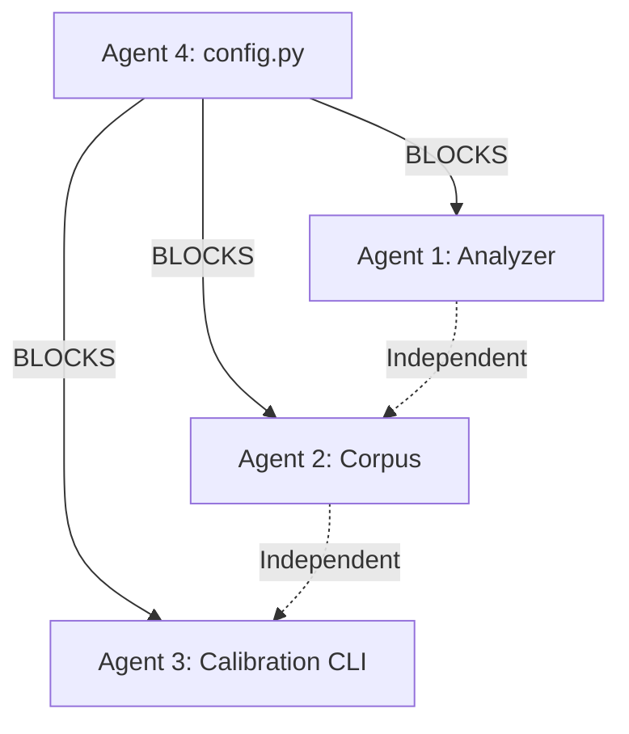

# Test Coverage Expansion: Implementation Guide

**Project:** lexile-corpus-tuner  
**Goal:** Increase test coverage from 55% to 90%+  
**Approach:** Phased, parallel agent development  
**Documents Created:** 5 comprehensive instruction files

---

## Quick Start

### For the Project Coordinator

1. **Review the Master Plan**
   - Read: `docs/test-coverage-expansion-plan.md`
   - Understand the phased approach and success metrics

2. **Assign Agents**
   - Agent 1: Core Lexile Pipeline → `docs/agent-1-instructions.md`
   - Agent 2: Corpus Pipeline → `docs/agent-2-instructions.md`
   - Agent 3: Calibration CLI → `docs/agent-3-instructions.md`
   - Agent 4: Utilities (START FIRST) → `docs/agent-4-instructions.md`

3. **Launch Sequence**
   - **Day 1:** Agent 4 starts with `textutils.py` (highest priority)
   - **Day 2:** After Agent 4 completes `textutils.py`, Agents 1, 2, 3 can all start in parallel
   - **Week 2+:** All agents work in parallel on their assigned modules

4. **Monitor Progress**
   - Agents update `docs/test-coverage-expansion-plan.md` daily
   - Check coverage increases with `poetry run pytest --cov`
   - Review quality gate compliance

---

## For Individual Agents

### How to Use Your Instructions

1. **Initial Setup (30 minutes)**
   - Read the master plan: `docs/test-coverage-expansion-plan.md`
   - Read your agent instructions: `docs/agent-[N]-instructions.md`
   - Read the standards: `.github/unit-test-policy.md` and `docs/code-change.instructions.md`
   - Review existing tests in `tests/` directory

2. **Loading Prompt**
   - Each agent instruction file contains a "Loading Prompt"
   - Copy this prompt and use it to initialize your session
   - The prompt contains all critical context and constraints

3. **Work Process**
   - Follow the task list in sequential order (unless dependencies require otherwise)
   - Complete each task's success checklist before moving to next
   - Run quality checks after EVERY test file
   - Update the master plan with daily progress

4. **Quality Gates (MANDATORY)**
   After writing any test file:
   ```powershell
   poetry run black .
   poetry run ruff check
   poetry run pyright
   poetry run pytest
   poetry run pytest --cov=src/lexile_corpus_tuner
   ```
   - ALL must pass before proceeding
   - If any fail, fix immediately and re-run

5. **Coordination**
   - Update `docs/test-coverage-expansion-plan.md` with:
     - ✅ Completed tasks
     - 🔄 In-progress tasks
     - Coverage increases
     - Any blockers

---

## Document Structure

### 1. Master Plan (`test-coverage-expansion-plan.md`)
- **Purpose:** Overall strategy and coordination
- **Contains:**
  - Coverage gap analysis
  - Phase breakdown (1: Foundation, 2: Integration, 3: Polish)
  - Agent assignments and dependencies
  - Success metrics and reporting templates
- **Audience:** All agents + coordinator

### 2. Agent Instructions (4 files)
- **Purpose:** Detailed task lists and guidance for each agent
- **Contains:**
  - Loading prompt with critical instructions
  - Module assignments
  - Detailed test case requirements
  - Mocking strategies
  - Success checklists
  - Common pitfalls
- **Audience:** Individual agents

### 3. Supporting Documents (existing)
- `unit-test-policy.md` - Test standards (MANDATORY)
- `code-change.instructions.md` - Code standards (MANDATORY)

---

## Key Design Principles

### 1. Standards Are Non-Negotiable
The instructions emphasize that standards compliance is **mandatory**:
- Every test must follow `unit-test-policy.md`
- Every code change must follow `code-change.instructions.md`
- No exceptions without explicit user approval
- If an agent cannot meet a standard, they must STOP and ask for guidance

**Why:** Previous agents have departed from standards. The instructions are designed to make this difficult through:
- Repetition of critical rules
- Explicit failure mode descriptions
- Mandatory quality gate sequences
- Clear success criteria

### 2. Phased Approach Prevents Overwhelm
- **Phase 1 (Weeks 1-2):** Foundation - Get to 70%
- **Phase 2 (Weeks 3-4):** Integration - Get to 85%
- **Phase 3 (Week 5):** Polish - Reach 90%+

Each phase has clear goals and success metrics.

### 3. Parallel Work Minimizes Conflicts
- Each agent owns distinct test files
- No two agents modify the same files
- Shared fixtures coordinated through master plan
- Dependencies clearly documented

### 4. Quality Gates Enforce Standards
After EVERY test file, agents must run (in order):
1. Black (formatting)
2. Ruff (linting)
3. Pyright (type checking)
4. Pytest (tests pass)
5. Pytest with coverage (coverage increases)

If ANY step fails, agent must fix before proceeding.

### 5. Comprehensive Guidance Reduces Questions
Each agent instruction includes:
- Detailed test case requirements
- Specific mocking strategies
- Code examples and fixtures
- Success checklists
- Common pitfalls to avoid
- Emergency contacts/resources

---

## Coverage Targets by Agent

| Agent | Modules | Current | Target | Est. LOC |
|-------|---------|---------|--------|----------|
| **1** | Analyzer + Calibration Core | ~35% | 90% | ~300 |
| **2** | Corpus Pipeline | ~18% | 90% | ~320 |
| **3** | Calibration CLI + Preprocessing | ~25% | 90% | ~200 |
| **4** | Utilities + Gaps | ~55% | 90% | ~150 |

**Total:** ~970 lines of new test code estimated

---

## Critical Dependencies



**Launch Order:**
1. Agent 4 completes `textutils.py` (Day 1)
2. Agents 1, 2, 3 start in parallel (Day 2+)
3. Agent 4 completes other modules in parallel (Day 2+)

---

## Success Metrics

### Phase 1 Complete (Week 2)
- ✅ Overall coverage ≥70%
- ✅ All assigned modules ≥70%
- ✅ Zero test failures
- ✅ All quality checks pass

### Phase 2 Complete (Week 4)
- ✅ Overall coverage ≥85%
- ✅ All assigned modules ≥85%
- ✅ Integration tests pass
- ✅ Error handling verified

### Phase 3 Complete (Week 5)
- ✅ Overall coverage ≥90%
- ✅ All modules ≥85% (documented exceptions okay)
- ✅ Comprehensive edge case coverage
- ✅ Full CI/CD pipeline passing

---

## Risk Mitigation

### Risk: Agents Depart from Standards
**Mitigation:**
- Standards emphasized in multiple places
- Explicit "failure modes to avoid" sections
- Mandatory quality gate sequences
- Clear success checklists

### Risk: Agent Conflicts
**Mitigation:**
- Clear file ownership (each agent owns their test files)
- No overlapping assignments
- Shared fixture coordination through master plan

### Risk: Coverage Regression
**Mitigation:**
- Always run full test suite before committing
- Coverage checks mandatory after each file
- Quality gates catch issues immediately

### Risk: Slow or Flaky Tests
**Mitigation:**
- Comprehensive mocking strategies provided
- Performance expectations documented (<1-2s per test)
- Deterministic test requirements emphasized

---

## Monitoring and Reporting

### Daily Updates (by each agent)
Add to `test-coverage-expansion-plan.md`:

```markdown
### Agent [N] Update - YYYY-MM-DD
**Phase:** [1/2/3]
**Completed:**
- test_module_x.py ✅
- test_module_y.py 🔄

**Coverage Changes:**
- module_x: 40% → 92%
- module_y: 25% → 78% (in progress)

**Blockers:** None / [describe]
**Next Steps:** Complete module_y, begin module_z
```

### Weekly Summary (by coordinator)
- Review all agent updates
- Check overall coverage progress
- Address any blockers
- Adjust priorities if needed

---

## What Makes These Instructions Effective

### 1. Repetition of Critical Rules
- Standards compliance mentioned in multiple sections
- Quality gates repeated throughout
- Success criteria restated for each task

### 2. Explicit Failure Modes
Each instruction file includes:
- "Common Pitfalls to Avoid" section
- "Failure Modes to AVOID" list
- Specific examples of what NOT to do

### 3. Mandatory Sequences
- Loading prompt must be read first
- Quality checks must run in specific order
- Tasks have dependencies clearly marked

### 4. Comprehensive Examples
- Code examples for fixtures
- Mocking strategy patterns
- Success checklist templates

### 5. Clear Accountability
- Each agent owns specific modules
- Progress tracked in shared document
- Success metrics are objective and measurable

---

## Getting Started

### For Agent 4 (START IMMEDIATELY)
```powershell
# Read your instructions
code docs/agent-4-instructions.md

# Confirm understanding of priorities
# Begin with textutils.py (HIGHEST PRIORITY)

# After completing textutils.py, notify others:
# Update test-coverage-expansion-plan.md with:
# "Agent 4: textutils.py COMPLETE ✅ - Other agents unblocked"
```

### For Agents 1, 2, 3 (WAIT FOR AGENT 4)
```powershell
# Read your instructions while waiting
code docs/agent-[N]-instructions.md

# Review existing tests
ls tests/

# Prepare your mocking strategies

# When Agent 4 completes textutils.py:
# Begin your assigned modules in parallel
```

---

## Questions and Support

### If Blocked or Uncertain:
1. Review existing tests in `tests/` for patterns
2. Consult `unit-test-policy.md` for test standards
3. Check `code-change.instructions.md` for code standards
4. Review your agent instructions again
5. Report blocker in `test-coverage-expansion-plan.md`
6. Request guidance from coordinator

### If Standards Unclear:
- **DO NOT** proceed with guesses
- **DO NOT** compromise on quality
- **STOP** and ask for clarification
- Document the ambiguity for future reference

---

## Final Notes

This documentation system is designed to:
- ✅ Make it difficult to depart from standards
- ✅ Provide comprehensive guidance at every step
- ✅ Enable parallel work without conflicts
- ✅ Ensure consistent quality across all agents
- ✅ Track progress transparently
- ✅ Achieve 90%+ coverage systematically

**The success of this effort depends on:**
1. Strict adherence to standards (no shortcuts)
2. Following the documented sequences (no skipping steps)
3. Regular progress updates (transparency)
4. Immediate blocker reporting (no silent struggles)

**Remember:** Quality over speed. Coverage is meaningless if tests don't actually verify correctness.
